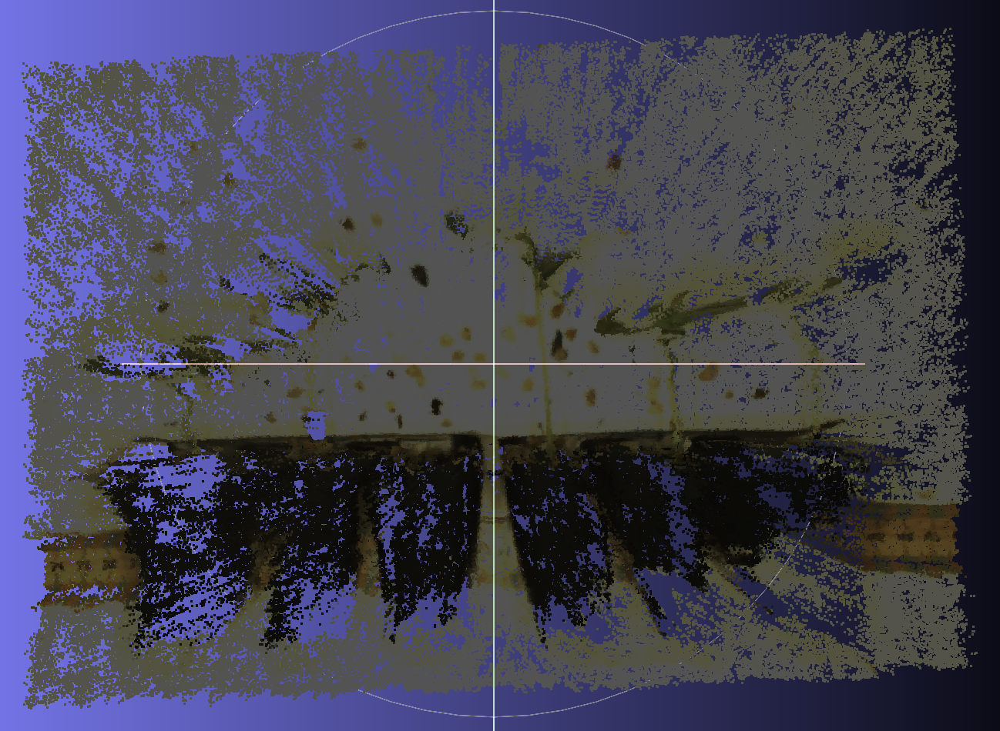
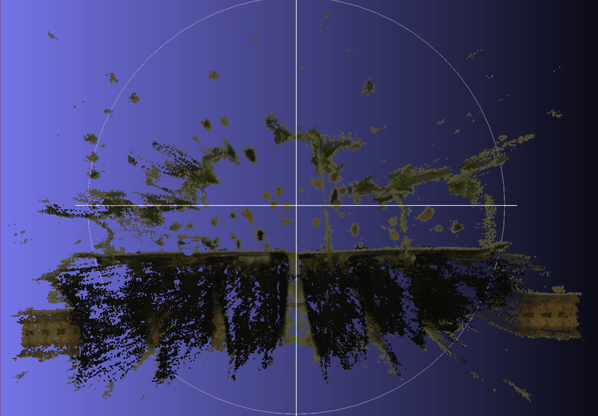
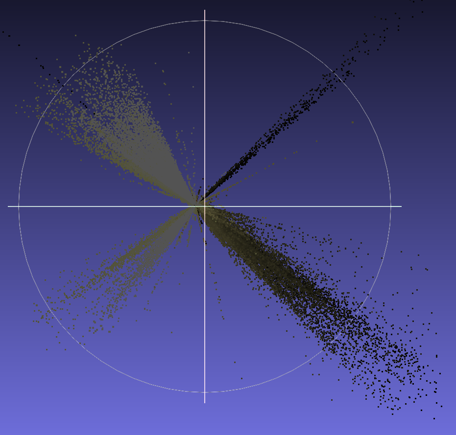
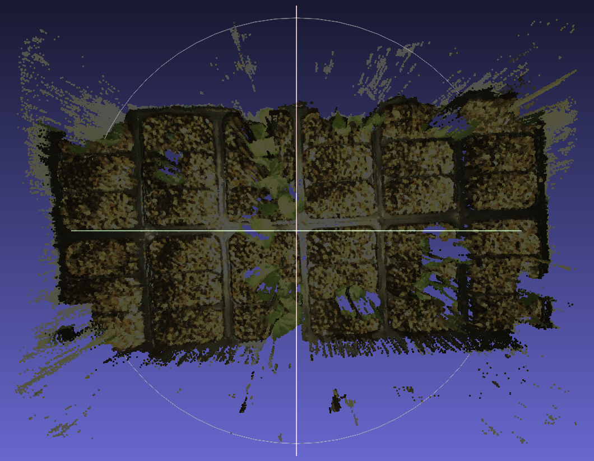

# Scripts
Scripts that filter point clouds of cotton seedling trays.

## Trad Side Clean
trad_side_clean.py cleans the Trad Side point clouds.

Before:

After:

## Trad Top Clean
trad_top_clean.py cleans the Trad Top point clouds.

Before:

After:

## Trad Top Clean and Setup
trad_top_clean_and_setup.py uses the code from Trad Top Clean to clean the Trad Top point clouds. Additionally, it creates a new Trad Top folder that houses the original Trad Top point cloud and its filtered version. In this folder is also where the individual seedling cuts can be put.